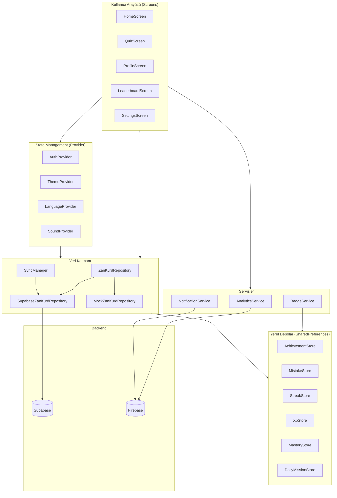

# ZanKurd Mimari Belgeleri

## Genel Bakış

ZanKurd, Kurmancî (Kürtçe) bilgi yarışması uygulamasıdır. Flutter ile geliştirilmiş olup,
Supabase backend ve Firebase entegrasyonu ile çalışır.

## Mimari Diyagram

## Katmanlar

### 1. UI Katmanı (`lib/src/screens/`)
- **HomeScreen** — Ana sayfa, kategori seçimi, hızlı yarış
- **QuizScreen** — Soru-cevap ekranı, zamanlayıcı, joker
- **ProfileScreen** — Kullanıcı profili, istatistikler, rozetler, XP
- **LeaderboardScreen** — Anonim lider tablosu
- **SettingsScreen** — Dil seçimi (KU/TR), tema geçişi, ses, oyuncu adı

### 2. State Management (`lib/src/providers/`)
- **AuthProvider** — Supabase kimlik doğrulama
- **ThemeProvider** — Aydınlık/Karanlık tema yönetimi
- **LanguageProvider** — Kurmancî/Türkçe dil yönetimi
- **SoundProvider** — Ses efektleri açma/kapama

### 3. Servisler (`lib/src/services/`)
- **AnalyticsService** — Anonim kullanım istatistikleri (Firebase Analytics)
- **NotificationService** — Günlük hatırlatıcı bildirimleri
- **BadgeService** — Genişletilmiş rozet/streak değerlendirmesi

### 4. Veri Katmanı (`lib/src/data/`)
- **ZanKurdRepository** — Soyut repository arayüzü
- **SupabaseZanKurdRepository** — Supabase bağlantılı gerçek uygulama
- **MockZanKurdRepository** — Test ve offline ortam için mock
- **SyncManager** — Offline XP senkronizasyonu

### 5. Yerel Depolar (`lib/src/data/`)
- **AchievementStore** — Rozet ilerlemesi ve kilit açma durumu
- **MistakeStore** — SM-2 algoritması ile yanlış soru takibi
- **StreakStore** — Günlük oyun serisi
- **XpStore** — Deneyim puanı ve seviye hesaplama
- **MasteryStore** — Kategori bazlı ustalık seviyeleri
- **DailyMissionStore** — Günlük görev ilerlemesi

## Teknoloji Yığını

| Katman | Teknoloji |
|--------|-----------|
| **Framework** | Flutter 3.44+ |
| **Dil** | Dart 3.12+ |
| **State** | Provider (ChangeNotifier) |
| **Backend** | Supabase (Auth, Database, Realtime) |
| **Crash Reporting** | Firebase Crashlytics |
| **Analitik** | Firebase Analytics |
| **Yerel Depo** | SharedPreferences |
| **Ses** | audioplayers |
| **Animasyonlar** | Lottie |
| **CI/CD** | GitHub Actions |

## Çift Dilli Destek

Uygulama Kurmancî (KU) ve Türkçe (TR) dillerini destekler:
- `lib/src/l10n/lang.dart` — `LanguageProvider` ve `LangContext` extension
- `lib/src/l10n/intl_tr.arb` — Türkçe çeviri kaynağı
- `lib/src/l10n/intl_ku.arb` — Kurmancî çeviri kaynağı
- Ekranlarda `context.isKu` ve `context.s(ku, tr)` helper'ları kullanılır

## Tema Sistemi

- `lib/src/theme/app_theme.dart` — Light ve Dark tema tanımları
- `lib/src/providers/theme_provider.dart` — Tema durumunu yönetir
- Glassmorphism: `lib/src/widgets/glass_panel.dart`
- Renkler: Coral/Orange gradient, Indigo secondary, Gold accent
