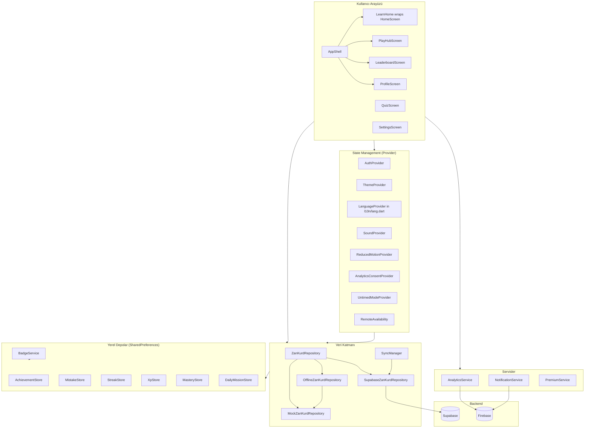

# ZanKurd Mimari Belgeleri

## Genel Bakış

ZanKurd, Kurmancî öncelikli bilgi yarışması ve öğrenme uygulamasıdır.
Flutter, Supabase, Firebase ve RevenueCat ile çalışır.

**Altın yol:** Öğren sekmesi (günün dersi) → solo quiz. Ana ekrandaki iki
kapı öğrenme alanına (Kurmancî öğren) ve Yarış'a (hızlı düello, davet
bağlantılı arkadaş odası) açılır. Hikâye, arkadaşlar, günlük çark ve
yerleştirme ikinci katmandadır (Kurmancî öğren ekranı, Liderlik, Mağaza,
Ayarlar). Turnuva ve haftalık lig `lib/src/config/feature_flags.dart` ile
kapalıdır; kitle büyüyünce açılır.

Kabuk sekmeleri: Öğren, Yarış, Liderlik, Profil.

## Mimari Diyagram

```mermaid
graph TB
    subgraph UI["Kullanıcı Arayüzü"]
        AS[AppShell]
        LH[LearnHome wraps HomeScreen]
        PH[PlayHubScreen]
        QS[QuizScreen]
        PS[ProfileScreen]
        LS[LeaderboardScreen]
        SS[SettingsScreen]
    end

    subgraph Providers["State Management (Provider)"]
        AP[AuthProvider]
        TP[ThemeProvider]
        LP[LanguageProvider in l10n/lang.dart]
        SP[SoundProvider]
        RM[ReducedMotionProvider]
        AC[AnalyticsConsentProvider]
        UM[UntimedModeProvider]
        RA[RemoteAvailability]
    end

    subgraph Services["Servisler"]
        ANS[AnalyticsService]
        NS[NotificationService]
        PRE[PremiumService]
    end

    subgraph Data["Veri Katmanı"]
        REPO[ZanKurdRepository]
        SUPA[SupabaseZanKurdRepository]
        MOCK[MockZanKurdRepository]
        OFFLINE[OfflineZanKurdRepository]
        SM[SyncManager]
    end

    subgraph Stores["Yerel Depolar (SharedPreferences)"]
        AS2[AchievementStore]
        MS[MistakeStore]
        SS2[StreakStore]
        XS[XpStore]
        MAS[MasteryStore]
        DMS[DailyMissionStore]
        BD[BadgeService]
    end

    subgraph Backend["Backend"]
        SB[(Supabase)]
        FB[(Firebase)]
    end

    AS --> LH
    AS --> PH
    AS --> LS
    AS --> PS
    UI --> Providers
    UI --> Data
    UI --> Services
    Providers --> Data

    REPO --> SUPA
    REPO --> MOCK
    REPO --> OFFLINE
    OFFLINE --> MOCK
    SUPA --> SB
    SM --> SUPA

    ANS --> FB
    BD --> Stores
    NS --> FB

    Data --> Stores
```

## Katmanlar

### 1. UI Katmanı (`lib/src/screens/`)
- **LearnHomeScreen** — Öğren sekmesi kökü; `HomeScreen`i sarmalar (kategori
  gezinmesi). İçerik `HomeScreen`dedir: günün dersi (tek birincil eylem),
  ilk oturumda "3 adımda ZanKurd", iki kapı (Kurmancî öğren / Arkadaşınla
  yarış) ve konu ızgarası (`screens/home/home_sections.dart`)
- **PlayHubScreen** — hızlı düello (birincil), arkadaş odası (davet
  bağlantısı), günlük etkinlik; turnuva bayrakla kapalı (`kTournamentEnabled`);
  sırayla düello kartı ve "Düellolarım" kutusu bayrakla kapalı (`kAsyncDuelEnabled`)
- **Sırayla düello** — `screens/async_duel/`: `AsyncDuelPlayScreen` (7 soru,
  20 sn, joker yok; çıkışta onaylanmamış sorular gönderilir),
  `AsyncDuelResultScreen` (tamamlandı/bekleniyor/süresi doldu/yarım kaldı;
  görüldü + XP talebi), `AsyncDuelInboxSection`/`AsyncDuelListScreen` (kabuğun
  Yarış tazelemesiyle yenilenir)
- **QuizScreen** — Soru-cevap, zamanlayıcı, joker
- **ProfileScreen** — İstatistik, rozet, XP, hesap
- **LeaderboardScreen** — Anonim lider tablosu
- **SettingsScreen** — Dil (KU/TR), tema, ses, oyuncu adı, güvenlik

### 2. State Management (`lib/src/providers/`)
- **AuthProvider** — Supabase kimlik doğrulama
- **ThemeProvider** — Aydınlık/Karanlık tema yönetimi
- **LanguageProvider** — `lib/src/l10n/lang.dart` içinde; Kurmancî/Türkçe
- **SoundProvider** — Ses efektleri açma/kapama (web'de sessizdir)
- **ReducedMotionProvider** — Hareketi azalt (kullanıcı + sistem tercihi)
- **AnalyticsConsentProvider** — Analitik ve Crashlytics rızası
- **UntimedModeProvider** — Süresiz quiz
- **RemoteAvailability** — Sunucu erişilebilirliği; sosyal yüzey kilidi

### 3. Servisler (`lib/src/services/`)
- **AnalyticsService** — Anonim kullanım istatistikleri (Firebase Analytics)
- **NotificationService** — Günlük hatırlatıcı bildirimleri
- **PremiumService** — `lib/src/services/premium_service.dart`; RevenueCat
  aboneliği (`ChangeNotifier`)

### 4. Veri Katmanı (`lib/src/data/`)
- **BadgeService** — `lib/src/data/badge_service.dart`; rozet tanımları `K.*`
- **ZanKurdRepository** — Soyut repository arayüzü
- **SupabaseZanKurdRepository** — Supabase bağlantılı gerçek uygulama
- **MockZanKurdRepository** — Test/demolar ve paylaşılan yerel içerik davranışı
- **OfflineZanKurdRepository** — Uzak servis başlatılamadığında üretim deposu.
  Mock deposunun yerel içeriğini kullanır; uzak kimlik ve sunucu yazımlarında
  sahte başarı döndürmez. Ders tamamlama, favoriler ve yerel profil adı
  cihazda saklanır; oda, eşleşme, ekonomi ve sosyal yazımlar kapalıdır.
- **SyncManager** — Çevrimdışı kuyruk (XP sahte eşitlemesi yok)
- **XP yazımı** — Cihaz `XPStore` seviye çubuğunu besler; sıralama
  puanı `award_xp_delta` ile `profiles.xp`e yazılır
  (`supabase/2026-09-02_award_xp_delta_write_restore.sql`). 2026-07-29
  göçü tarihsel no-op olarak durur; yeniden çalıştırılmaz.
- **Sırayla düello verisi** — `models/async_duel.dart`;
  `ZanKurdRepository.startAsyncDuel/answerAsyncDuel/loadMyAsyncDuels/markAsyncDuelSeen/claimAsyncDuelXp`.
  Kazanan, XP ve 48 saat kuralı sunucuda (`supabase/2026-09-28_async_duels.sql`,
  henüz UYGULANMADI; bkz. `supabase/applied.md`)
- **Davet bağlantısı** — `utils/join_deep_link.dart`: `zankurd.com/join/KOD`;
  soğuk açılış `onGenerateInitialRoutes`, sıcak açılış `JoinDeepLinkScope`
  (`didPushRouteInformation`). iOS associated domains + Android App Links;
  web tarafı `web/.well-known/` (bkz. `docs/HOSTINGER_DEPLOY_CHECKLIST.md`)

### 5. Yerel Depolar (`lib/src/data/`)
- **AchievementStore** — Rozet ilerlemesi ve kilit açma durumu
- **MistakeStore** — SM-2 algoritması ile yanlış soru takibi
- **StreakStore** — Günlük oyun serisi
- **XpStore** — Deneyim puanı ve seviye hesaplama
- **MasteryStore** — Kategori bazlı ustalık seviyeleri
- **DailyMissionStore** — Günlük görev ilerlemesi

## Teknoloji Yığını

| Katman | Teknoloji |
|--------|-----------|
| **Framework** | Flutter 3.44+ |
| **Dil** | Dart 3.12+ |
| **State** | Provider (ChangeNotifier) |
| **Backend** | Supabase (Auth, Database, Realtime) |
| **Crash Reporting** | Firebase Crashlytics |
| **Analitik** | Firebase Analytics |
| **Yerel Depo** | SharedPreferences |
| **Ses** | audioplayers |
| **Animasyonlar** | Flutter yerleşik (`AnimationController`, `CustomPainter`) |
| **CI/CD** | GitHub Actions |

## Çift Dilli Destek

Uygulama Kurmancî (KU) ve Türkçe (TR) dillerini destekler:
- `lib/src/l10n/lang.dart` — `LanguageProvider` ve `LangContext` extension
- `lib/src/l10n/strings.dart` — **anahtar tabanlı kayıt defteri**; metinlerin
  tek kaynağı burasıdır (`K.anahtar` → `{ku, tr}`)
- Ekranlarda `context.t(K.anahtar)` kullanılır. `context.s(ku, tr)` yalnız
  geriye dönük uyumluluk için duruyor ve yeni kullanımı bekçi testini kırar
  (`test/l10n_migration_guard_test.dart`).

> `intl_tr.arb` / `intl_ku.arb` dosyaları YOKTUR; bu belge 2026-07-31'e
> kadar onları kaynak gibi gösteriyor ve yeni geliştiriciyi var olmayan
> bir API'ye yönlendiriyordu.

## Tema Sistemi

- `lib/src/theme/app_theme.dart` — Light ve Dark
- `lib/src/providers/theme_provider.dart`
- Palet: koyu antrasit, derin yeşil, krem. Mercan yalnız birincil eylemde.
  Altın yalnız ödül/premium. Cam paneli yok: `glass_panel.dart`,
  `CardType.glass`, `glassDecoration` ve `AppPanel` BackdropFilter
  kaldırıldı. Yeni ekranlar `primary` / `secondary` / `info` kullanır.
