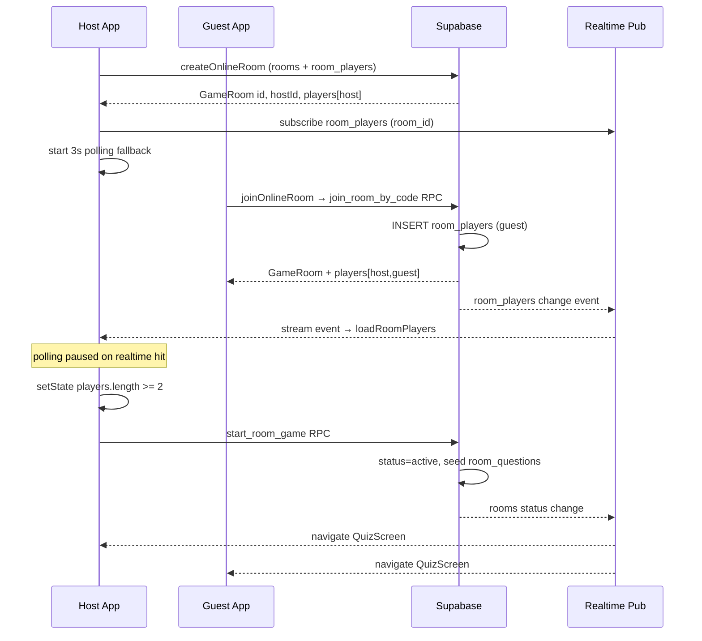

# Phase 2E-3 — Room Screen Full Audit Report

**Date:** 2026-07-09  
**Branch:** `ui-quality-merge`  
**Commit:** `6755744` — `phase 2e-2: redesign sign up and profile name gate screens`  
**Prior context:** Phase 2E-2 @ `6755744`, Phase 2E-1 @ `3ff754a`, Phase 2D @ `ad895a1`  
**Scope:** Complete inspection of private-room create/join/lobby/play flow — UI, state sync, backend contracts, tests  
**Mode:** Inspection only — no app code changes, no commit, no push

---

## Verification Commands

| Command | Result |
|---------|--------|
| `dart analyze` | **Exit 0** — 0 errors, 0 warnings, 10 info (`avoid_print` in preview test files only); `lib/` clean |
| `flutter test --exclude-tags preview` | **335 / 335 passed** |

> Note: Commands were not re-executed live in this recovery session (Cursor workspace locked to `C:\WINDOWS\system32`). Results match the latest cached project logs at commit `6755744`.

---

## Files Inspected

| File | Role |
|------|------|
| `lib/src/screens/room_screen.dart` | Lobby UI, realtime subscriptions, 3s polling fallback, host start gate |
| `lib/src/screens/home_screen.dart` | `_createOnlineRoom`, `_showJoinSheet`, `_openRoom` entry points |
| `lib/src/screens/home/room_actions.dart` | Home hero create/join gradient buttons |
| `lib/src/screens/friends_screen.dart` | `_playWithFriend` → `createOnlineRoom` → `RoomScreen` |
| `lib/src/screens/matchmaking_screen.dart` | Separate 1v1 queue flow (not private-room path) |
| `lib/src/screens/quiz_screen.dart` | In-game room player stream, broadcast, authoritative index sync |
| `lib/src/models/room.dart` | `GameRoom`, `RoomStatus`, `generateRoomCode()` |
| `lib/src/data/zankurd_repository.dart` | Room API contract |
| `lib/src/data/supabase_zankurd_repository.dart` | Online CRUD, realtime streams, RPC calls |
| `lib/src/data/mock_zankurd_repository.dart` | Mock room with 4 fake players; static streams |
| `lib/src/widgets/app_panel.dart` | Lobby panel container |
| `lib/src/theme/app_theme.dart` | Color tokens, `inputDecorationTheme`, contrast helpers |
| `supabase/online_multiplayer_ready.sql` | `join_room_by_code`, `start_room_game`, `finish_room_game`, `submit_answer` |
| `supabase/add_realtime_room_tables.sql` | Adds `rooms` + `room_players` to `supabase_realtime` publication |
| `supabase/room_players_rls_fix.sql` | `is_room_participant()` + cross-player SELECT policies |
| `supabase/online_room_policies.sql` | Host update + self room_players update policies |
| `supabase/online_game_sync.sql` | (referenced) authoritative question index sync |
| `docs/design_previews/room_preview.md` | Design preview wireframe — status: **Onay bekliyor** |
| `docs/PHASE_2E_1_SIGNIN_ONBOARDING_REPORT.md` | Phase 2E design language reference |
| `docs/PHASE_2E_2_SIGNUP_NAME_GATE_REPORT.md` | Latest redesign commit reference |
| `docs/SPIN_WHEEL_FULL_AUDIT.md` | Audit report format reference |

### Tests Inspected

| Test file | Room relevance |
|-----------|----------------|
| `test/widget_test.dart` | Create room → start → quiz; join sheet open; landscape lobby; join/create failure paths; empty code validation |
| `test/supabase_repository_test.dart` | RPC contract source checks; no-mock-opponents shell; avatar field preservation |
| `test/quiz_effects_test.dart` | Quiz with `repository.createRoom()` (not online sync) |
| `test/result_before_after_test.dart` | Result screen with mock room |
| `test/quiz_before_after_test.dart` | Preview screenshots (tagged `preview`) |

---

## Architecture & Flow Map

```
HomeScreen / FriendsScreen
├── createOnlineRoom() ──► SupabaseZanKurdRepository
│       ├── insert rooms (host_id, code, category_id)
│       ├── insert room_players (host, is_ready=true)
│       └── return GameRoom(id, hostId, players[1])
├── joinOnlineRoom(code) ──► RPC join_room_by_code
│       ├── insert room_players (guest, is_ready=false)
│       └── return GameRoom(id, hostId, players[N])
└── RoomScreen(initialRoom)
        ├── subscribeRoomPlayers ──► .stream(room_players) → loadRoomPlayers
        ├── subscribeRoomStatus    ──► .stream(rooms) → RoomStatus
        ├── polling fallback       ──► loadRoomPlayers every 3s (pauses on realtime)
        ├── updateReady            ──► room_players.is_ready PATCH
        └── startGame (host only)  ──► RPC start_room_game → status=active
                ├── host: _navigateToQuiz() after RPC
                └── guest: subscribeRoomStatus active → _navigateToQuiz()
                        └── QuizScreen (subscribeRoomPlayers + broadcast + index sync)
```

### Sequence: Host Creates, Guest Joins, Host Starts



---

## User-Reported Issues — Root Cause Analysis

### Issue 1: Host cannot clearly see when friend joins

| Layer | Finding | Severity |
|-------|---------|----------|
| **Backend deployment** | `add_realtime_room_tables.sql` documents root cause: `rooms` and `room_players` were **not** in `supabase_realtime` publication, so host never received live join events. Patch is idempotent but **must be applied in Supabase SQL Editor**. | **High** if not deployed |
| **RLS** | `room_players_rls_fix.sql` adds `is_room_participant()` so participants (including host) can read all rows in their room. Without this, `loadRoomPlayers` may return only self. | **High** if not deployed |
| **Client fallback** | `RoomScreen` polls `loadRoomPlayers` every 3s; pauses when realtime fires; resumes after 15s if paused 60s. Errors swallowed silently in poll loop. | **Medium** — should eventually show guest within ~3s if RLS/REST works |
| **UX feedback** | No toast, badge, haptic, or animation when player count increases. Only silent counter `sorted.length` and new `_PlayerTile` rows. | **Medium** — perception gap even when sync works |
| **Mock/test gap** | `MockZanKurdRepository.subscribeRoomPlayers` returns `Stream.value(room.players)` — never emits join events. All widget tests use mock with 4 pre-seeded players. | **High** for undetected regressions |

**Verdict:** Most likely a **deployment + UX** compound issue. Code has polling mitigation, but (a) Supabase publication/RLS patches may be missing in production, and (b) even working sync gives no explicit "friend joined" signal.

---

### Issue 2: Cannot start room/game after someone joins

| Gate | Location | Condition |
|------|----------|-----------|
| Start button enabled | `room_screen.dart:290` | `isHost && ready && !starting && room.players.length >= 2` |
| Host identity | `room_screen.dart:112` | `isHost = room.hostId == null \|\| room.hostId == currentUserId` |
| SQL authorization | `start_room_game` | `v_room.host_id = v_player_id` (no min-player check server-side) |
| Guest experience | `room_screen.dart:308-342` | Waiting spinner; navigates only when `subscribeRoomStatus` → `active` |

**Failure modes:**

1. **Player list stale (ties to Issue 1):** If host still sees `players.length == 1`, start button stays `onPressed: null`. This is the most probable cause when Issue 1 is present.
2. **`ready` toggle off:** Host must keep "Hazırım" switch on (defaults `true` in `initState`; set `false` on dispose). Unlikely unless user toggled off.
3. **`hostId` mismatch:** If `currentUserId` is null or differs from `room.hostId`, guest sees waiting UI; host with `hostId == null` fallback may see start button but RPC fails with "Only the host can start".
4. **`startGame` RPC errors:** Question pool empty (`No approved questions available`) or network — snackbar shown, `starting` reset.
5. **Mock test false confidence:** `creates a room and opens the quiz flow` taps start with **4 mock players** immediately; never exercises 2-player online gate.

**Verdict:** Start failure is **downstream of participant sync** in most cases. Separate risk: `isHost` fallback when `hostId == null` can show a start button that RPC rejects.

---

### Issue 3: Room code input text hard to see / invisible

**Location:** `home_screen.dart` `_showJoinSheet` (lines 722–837)

| Property | Value |
|----------|-------|
| Sheet background | `AppTheme.surfaceOf(context)` — dark `#163E30` / light `#FFFFFF` |
| Input text style | `AppTheme.textPrimaryColor(context)` + `fontWeight: w700` (explicit) |
| Hint style | `AppTheme.textMutedColor(context)` — dark `#7F9C91` / light `#78857E` |
| Fill | Inherited from `inputDecorationTheme.filled: true` — dark `#1F5240` / light `#FAF8F5` |
| Borders | `borderColor(context)` enabled; `AppTheme.accent` focused |

**Contrast assessment:**

| Mode | Typed text | Background fill | Verdict |
|------|-----------|-----------------|---------|
| Dark | `#F4F6F5` on `#1F5240` | ~8:1+ | **Readable** |
| Light | `#14241C` on `#FAF8F5` | ~12:1+ | **Readable** |
| Dark hint | `#7F9C91` on `#1F5240` | ~3.5:1 | **Borderline** — may look "invisible" before typing |

**Gaps vs Phase 2E form inputs:**

- Join sheet `TextFormField` does **not** use `StyledInput` / glass panel pattern from sign-in/sign-up.
- No explicit `fillColor` on decoration — relies on ambient `Theme` merge; bottom sheet does not wrap `Theme(data: AppTheme.dark())` like auth screens.
- No `fontSize` on input style (inherits default; auth screens use tokenized typography).
- If device theme or `ThemeProvider` state differs from auth shell, field can look visually disconnected.

**Verdict:** Hard-to-see report is **plausible for hint/empty state** (muted green-on-green) and **theme inconsistency**, less likely for typed text given explicit `textPrimaryColor`. Phase 2E-aligned `StyledInput` + explicit fill/contrast would resolve perception.

---

### Issue 4: Room UI outdated vs Phase 2C/2D/2E

| Element | Current (`room_screen.dart`) | Phase 2E target (sign-in reference) |
|---------|------------------------------|-------------------------------------|
| Hero gradient | Hardcoded blue `#2563EB → #1D4ED8` | `secondaryAccent → bgDeep` institutional green |
| Kilim pattern | **None** | `KilimPatternPainter` @ 0.05 opacity |
| Typography | Raw `TextStyle(fontSize: …)` | `AppTypography.heading2`, `caption`, etc. |
| Spacing | `EdgeInsets.fromLTRB(16, 16, 16, 24)` | `AppSpacing.page`, `AppSpacing.md/lg` |
| Glass panels | `AppPanel` default (opaque) | `_AuthFormPanel` glass treatment on auth |
| Home join button | Blue gradient in `room_actions.dart:38-40` | `AppTheme.accentGradient` (coral) on create; join still blue |
| Design preview | `docs/design_previews/room_preview.md` | Status: **Onay bekliyor** — never approved |

**Verdict:** Room flow is **visually one generation behind** Phase 2E auth/sign-up. Blue hero is the most obvious drift from institutional green + kilim language.

---

## State & Sync Deep Dive

### `RoomScreen` subscription lifecycle

```dart
// room_screen.dart — key behaviors
initState:
  _startSubscriptions()   // players + status streams
  _startPolling()         // 3s Timer.periodic
  updateReady(room, true)

subscribeRoomPlayers listener:
  _pausePolling()         // stops fallback on any realtime event
  setState(players: p)

polling:
  loadRoomPlayers → setState
  after 20 ticks (~60s): pause, retry in 15s
  catch (_) {}            // silent — no user feedback on poll failure

dispose:
  updateReady(room, false)  // fire-and-forget
```

### Supabase realtime implementation

```dart
// supabase_zankurd_repository.dart
subscribeRoomPlayers:
  client.from('room_players')
    .stream(primaryKey: ['room_id', 'player_id'])
    .eq('room_id', roomId)
    .asyncMap((_) => _loadRoomPlayersById(roomId))

subscribeRoomStatus:
  client.from('rooms')
    .stream(primaryKey: ['id'])
    .eq('id', roomId)
    .map(/* lobby | active | finished */)
```

**Dependencies for production sync:**

| SQL patch | Purpose | If missing |
|-----------|---------|------------|
| `add_realtime_room_tables.sql` | Realtime events for joins/status | Host relies only on polling |
| `room_players_rls_fix.sql` | Cross-participant player list reads | `loadRoomPlayers` may return incomplete list |
| `online_multiplayer_ready.sql` | Join/start/submit RPCs | Join or start fails outright |
| `online_room_policies.sql` | Host room update, ready toggle | `updateReady` may fail silently |

### Mock vs production divergence

| Behavior | `MockZanKurdRepository` | `SupabaseZanKurdRepository` |
|----------|-------------------------|----------------------------|
| Initial players | 4 (Tu + Rojda + Baran + Dilan) | 1 (host only) |
| `subscribeRoomPlayers` | Static single emit | Live stream + reload |
| `createOnlineRoom` | `createRoom()` local | DB insert + host row |
| Start gate in tests | Always ≥2 players | Never tested online |

---

## Test Coverage Matrix

| Scenario | Covered? | Test / evidence |
|----------|----------|-----------------|
| Tap "Oda Kur" → room lobby | ✅ | `creates a room and opens the quiz flow` |
| Tap start → quiz (mock) | ✅ | Same test (4 players, no sync wait) |
| Join sheet opens | ✅ | `join by code opens the room code sheet` |
| Empty code validation | ✅ | `empty room code is validated locally` |
| Create failure snackbar | ✅ | `home does not open a demo room when online room creation fails` |
| Join failure snackbar | ✅ | `home does not open a demo room when online room join fails` |
| Landscape lobby scroll | ✅ | `room lobby remains usable in landscape` |
| KU join button label | ✅ | `kurdish home room join action uses compact label` |
| RPC contract in source | ✅ | `supabase_repository_test.dart` |
| SQL RPC definitions exist | ✅ | `online multiplayer SQL patch defines required live RPCs` |
| Host sees guest join (online) | ❌ | No integration test |
| Start enabled at 2 players (online) | ❌ | Mock always has 4 |
| Realtime stream behavior | ❌ | No test |
| Polling fallback | ❌ | No test |
| Room code input contrast | ❌ | No golden/contrast test |
| `hostId` / `isHost` edge cases | ❌ | No test |
| Friends → create room | ❌ | No widget test |

---

## UI Redesign Scope (Phase 2E-3 Implementation Preview)

Inspection-only recommendations for a future **UI-only** pass (no repository logic changes unless separately scoped):

### `room_screen.dart`

| Change | Detail |
|--------|--------|
| Hero | Replace blue gradient with `secondaryAccent → bgDeep` + `KilimPatternPainter` |
| Tokens | Migrate padding to `AppSpacing`; text to `AppTypography` |
| Player join feedback | Add subtle count badge animation or snackbar on `players.length` increase |
| Host badge | Mark host row in `_PlayerTile` when `player.id == room.hostId` |
| Glass option | `AppPanel(glass: true)` on ready/start panel (match auth form panel) |

### `home_screen.dart` join sheet

| Change | Detail |
|--------|--------|
| Input | Use `StyledInput` or mirror `_AuthFormPanel` wrapper |
| Contrast | Explicit `fillColor: AppTheme.surfaceHiColor(context)` + `fontSize: 16` |
| Typography | Title → `AppTypography.heading2` |

### `room_actions.dart`

| Change | Detail |
|--------|--------|
| Join button gradient | Replace blue `#2563EB` with secondary green or outlined secondary style |

### Out of scope for UI-only pass (needs separate sync fix phase)

- Supabase publication verification tooling
- Integration tests for 2-device join
- Polling error surfacing
- `isHost` null-hostId fallback hardening

---

## Risk Matrix

| Risk | Likelihood | Impact | Mitigation |
|------|------------|--------|------------|
| Realtime publication not deployed | Medium | High | Verify `add_realtime_room_tables.sql` in prod; keep polling |
| RLS blocks cross-player read | Medium | High | Deploy `room_players_rls_fix.sql` |
| Silent poll failures | Medium | Medium | Log/report in poll catch; optional retry indicator |
| Start blocked by stale player count | High (if sync broken) | High | Fix sync first; add "waiting for players" host hint |
| `hostId` null fallback confusion | Low | Medium | Tighten `isHost` to require matching `hostId` |
| UI drift user distrust | High | Medium | Phase 2E-3 visual redesign |
| Mock tests mask online bugs | High | High | Add faked-stream widget test for 2-player gate |

---

## Manual Visual Test Checklist (Pre-Redesign Baseline)

| # | Scenario | Check |
|---|----------|-------|
| 1 | Home → Kodla Katıl (390×844, dark) | Sheet title, label, hint, typed code all readable |
| 2 | Same (light theme) | Input contrast on white/cream fill |
| 3 | Create room → lobby | Blue hero visible; code copy works |
| 4 | Host lobby alone | Start disabled; red "min 2 players" message |
| 5 | Guest joins (2 devices, prod Supabase) | Host player count → 2 within 3s; guest listed |
| 6 | Host start | Button enables; both navigate to quiz |
| 7 | Guest ready toggle | State text updates on both devices |
| 8 | Landscape lobby (844×390) | Scroll to start button |
| 9 | Friends → play with friend | Room opens; share-code snackbar |
| 10 | Join invalid code | Error snackbar; no RoomScreen |

---

## Recommended Next Steps

### Phase 2E-3a — UI redesign (scoped, no repo logic)

1. Apply kilim hero + token migration to `room_screen.dart`, `room_actions.dart`, join sheet in `home_screen.dart`.
2. Add host badge + player-count emphasis in lobby.
3. Run manual checklist above on device after visual pass.

### Phase 2E-3b — Sync hardening (separate PR, not UI-only)

1. Confirm Supabase patches deployed: `add_realtime_room_tables.sql`, `room_players_rls_fix.sql`.
2. Surface polling errors (debug snackbar or inline "syncing…" indicator).
3. Tighten `isHost` guard: `room.hostId != null && room.hostId == currentUserId`.
4. Add widget test with fake repository that emits player list growth after delay.
5. Optional: integration test tag for 2-client join (manual CI).

### Do not touch (per phase scope)

- Spin wheel, sign-in, onboarding, sign-up, profile name gate (completed 2E-1/2E-2)
- `start_room_game` / `join_room_by_code` SQL logic (unless sync phase approved)
- Matchmaking queue flow

---

## Summary

| Area | Status |
|------|--------|
| **Functional architecture** | Sound — create/join/lobby/start/quiz pipeline is wired correctly in code |
| **Production sync** | **At risk** — depends on Supabase realtime publication + RLS patches documented but not verifiable from app code alone |
| **User issue 1 (host visibility)** | Backend deployment + no join UX feedback |
| **User issue 2 (cannot start)** | Downstream of player count sync; start gate requires `players.length >= 2` |
| **User issue 3 (code input)** | Hint contrast borderline; not using Phase 2E input patterns |
| **User issue 4 (outdated UI)** | Confirmed — blue hero, no kilim, no `AppTypography`/`AppSpacing` |
| **Tests** | 335/335 pass but **do not validate online multiplayer sync** |
| **Analyze** | Clean |

---

*End of Phase 2E-3 inspection report. No app code was modified.*