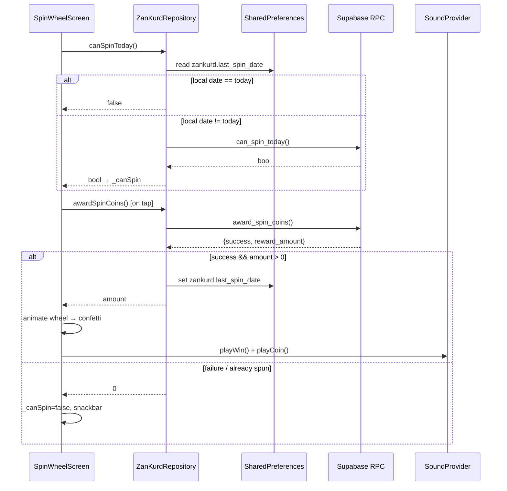
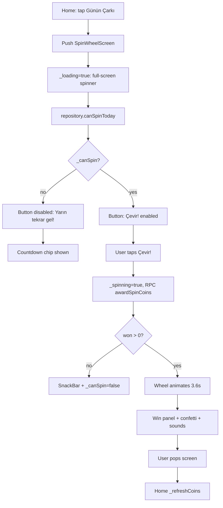

# Spin Wheel Screen — Full Audit Report

**Date:** 2026-07-08  
**Branch:** `ui-quality-merge` @ `ad895a1`  
**Scope:** Complete review of `spin_wheel_screen.dart` and all related dependencies  
**Mode:** Inspection only — no app code changes, no commit, no push

---

## Verification Commands

| Command | Result |
|---------|--------|
| `dart analyze` | **Exit 0** — 0 errors, 0 warnings, 10 info (`avoid_print` in preview test files only); `lib/` clean |
| `flutter test --exclude-tags preview` | **335 / 335 passed** |

---

## Files Inspected

| File | Role |
|------|------|
| `lib/src/screens/spin_wheel_screen.dart` | Screen UI, state, animation, eligibility gate |
| `lib/src/data/zankurd_repository.dart` | `canSpinToday()`, `awardSpinCoins()` contract |
| `lib/src/data/mock_zankurd_repository.dart` | Mock spin logic, extra spins, UTC day check |
| `lib/src/data/supabase_zankurd_repository.dart` | Prefs cache + Supabase RPC |
| `supabase/2026-07-06_spin_wheel_backend.sql` | `can_spin_today`, `award_spin_coins` RPCs |
| `supabase/daily_spin_rpc.sql` | Legacy `claim_daily_spin()` — **not used by app** |
| `lib/src/screens/home_screen.dart` | Navigation + `_refreshCoins()` on return |
| `lib/src/screens/home/quick_play_grid.dart` | Home entry tile |
| `lib/src/screens/shop_screen.dart` | `spin_wheel_extra` shop item |
| `lib/src/providers/sound_provider.dart` | Win/coin audio |
| `lib/src/utils/analytics_tracker.dart` | `trackSpinWheelSpun()` (unused) |
| `lib/src/widgets/confetti_overlay.dart` | Win celebration |
| `lib/src/widgets/app_panel.dart` | Win panel |
| `lib/src/widgets/kilim_pattern_painter.dart` | Hero pattern |
| `lib/src/theme/app_theme.dart` | Design tokens (referenced) |
| Git commit `ca6633d` | "Fix daily spin wheel lock and speed up leaderboard refresh updates" |
| Git diff `418f96b..ad895a1` | Phase 2D UI changes only |

### Tests Inspected

| Test file | Relevance |
|-----------|-----------|
| `test/widget_test.dart` | Spin wheel navigation smoke test |
| `test/quick_play_grid_test.dart` | Home grid tile label and tap wiring |
| `test/quickplay_before_after_test.dart` | Preview stub `onSpinWheel` |
| `test/wildcard_test.dart` | `spendCoins` / balance (not spin) |
| `test/coin_calculator_test.dart` | Quiz coin formula (not spin) |
| `test/daily_mission_store_test.dart` | Mission coin rewards (not spin) |
| `test/profile_before_after_test.dart` | Profile screenshot (not spin) |
| `test/supabase_repository_test.dart` | Avatar SQL source checks (not spin) |

---

## Architecture & Dependency Map

```
spin_wheel_screen.dart
├── ZanKurdRepository (injected)
│   ├── MockZanKurdRepository      ← tests, offline fallback for canSpinToday
│   └── SupabaseZanKurdRepository  ← production
│       ├── SharedPreferences (zankurd.last_spin_date)
│       ├── RPC can_spin_today / award_spin_coins
│       └── SQL 2026-07-06_spin_wheel_backend.sql
├── SoundProvider (Provider.read)   ← win/coin audio
├── ErrorReporter                   ← exception logging
├── AppTheme / AppTypography / AppSpacing / AppRadius
├── KilimPatternPainter, AppPanel, ConfettiOverlay
└── (not used) AnalyticsTracker.trackSpinWheelSpun
```

### Sequence Diagram (Production Flow)



---

## 1. Screen Purpose and User Flow

### Purpose

Daily gamified coin reward: one free spin per calendar day (server-enforced), presented as an 8-segment wheel with values `[10, 25, 50, 15, 75, 20, 100, 30]`.

### Entry Point

`HomeScreen._openSpinWheel()` pushes `SpinWheelScreen(repository: repo)` via `AppRoute.to()`. On pop, `_refreshCoins()` runs so the home coin badge updates.

Home grid tile: `quick_play_grid.dart` — title "Günün Çarkı" / "Çerxa Rojê", `onTap: onSpinWheel`.

### User Flow (Open → Reward)



### Step-by-Step (Code Path)

1. **`initState`** — Creates `AnimationController` (3600ms), sets up haptic segment listener, calls `_checkSpin()` and `_startCountdown()`.
2. **`_checkSpin()`** — Calls `widget.repository.canSpinToday()`. On success sets `_canSpin`; on catch shows snackbar and leaves `_canSpin=false`. Sets `_loading=false`.
3. **Eligible state** — `FilledButton` enabled with label "Çevir!" / "Bizivirîne!".
4. **`_spin()`** — Guard: `if (_spinning || !_canSpin) return`. Sets `_spinning=true`, clears `_wonAmount`.
5. **RPC** — `awardSpinCoins()` called **before** animation (server-authoritative, anti-cheat correct).
6. **On `won <= 0`** — Sets `_spinning=false`, `_canSpin=false`, snackbar "Bugün zaten çevirdin.", returns (no animation).
7. **On `won > 0`** — Computes `winnerIndex`, builds rotation tween (5 full turns + segment alignment), runs animation, then sets `_wonAmount`, `_showConfetti=true`, plays sounds.
8. **Return to home** — Coin balance refreshed via `_refreshCoins()`.

### All States

| State | UI Signals | `_canSpin` | `_spinning` | `_loading` | `_wonAmount` |
|-------|------------|------------|-------------|------------|--------------|
| **Loading** | Full-screen `CircularProgressIndicator` (accent color); wheel hidden | `false` (default) | `false` | `true` | `null` |
| **Eligible** | "Çevir!" enabled, casino icon | `true` | `false` | `false` | `null` |
| **Spinning** | "Dönüyor…" + button spinner; wheel static until RPC returns | `true`* | `true` | `false` | `null` |
| **Reward received** | Gold `AppPanel` win banner, confetti overlay, sounds | `false` | `false` | `false` | `amount` |
| **Already spun today** | "Yarın tekrar gel!" disabled + countdown chip | `false` | `false` | `false` | `null` or prior win amount |
| **Error (eligibility)** | SnackBar "Çark durumu kontrol edilemedi" + disabled button appears as cooldown | `false` | `false` | `false` | `null` |
| **Error (award)** | SnackBar "Ödül verilemedi"; button may re-enable if `_canSpin` still true | unchanged | `false` | `false` | `null` |
| **Offline / failed award** | `awardSpinCoins` catch returns `0`; no offline fallback (unlike `canSpinToday`) | set `false` if `won<=0` | `false` | `false` | `null` |

\*Button is disabled during `_spinning` regardless of `_canSpin` via `onPressed: (_canSpin && !_spinning) ? _spin : null`.

### Does the User Always Understand What to Do Next?

| Situation | Clear? | Issue |
|-----------|--------|-------|
| Eligible | **Yes** — "Çevir!" is unambiguous | — |
| Won | **Yes** — celebration panel | No explicit "go back" CTA; no on-screen balance update |
| Cooldown | **Mostly** — disabled CTA + countdown | Copy implies "come back tomorrow" not exact reset mechanics |
| Eligibility error | **No** — identical UI to cooldown | User cannot distinguish network/auth error from already-spun |
| Unauthenticated | **No** — looks like cooldown | No sign-in prompt |
| During RPC wait | **Partial** — "Dönüyor…" but wheel frozen | Feels unresponsive for network latency |

---

## 2. Eligibility Logic

### Where Is Last Spin Date Read?

| Layer | Location | Key / Field |
|-------|----------|-------------|
| **Production (client)** | `SupabaseZanKurdRepository.canSpinToday()` lines 976–977 | `SharedPreferences` → `zankurd.last_spin_date` (string format `YYYY-M-D`, unpadded) |
| **Production (server)** | `can_spin_today` RPC in `2026-07-06_spin_wheel_backend.sql` | `spin_wheel_history.spin_date` — latest row for user |
| **Mock** | `MockZanKurdRepository` | In-memory `DateTime? _lastSpin` (UTC) |
| **Screen** | Does not read date directly | Delegates entirely to `repository.canSpinToday()` |

Prefs are **written** only after successful `awardSpinCoins()` with `amount > 0` (lines 1007–1012 in `supabase_zankurd_repository.dart`).

### Where Is Daily Eligibility Calculated?

1. **Client short-circuit (production):** If `zankurd.last_spin_date` equals today's local date string → return `false` without calling server.
2. **Server RPC:** `can_spin_today` → `RETURN v_last_spin IS NULL OR v_last_spin < v_today` where `v_today := CURRENT_DATE`.
3. **Mock:** UTC year/month/day comparison on `_lastSpin`; if daily spin used, checks `_mockExtraSpins > _mockUsedExtraSpins` for shop-purchased extra spins.
4. **Screen:** `_checkSpin()` called once on `initState`; result stored in `_canSpin`. No re-check on app resume or tab switch.

### How Are Today/Yesterday Compared?

| Path | Comparison Method |
|------|-------------------|
| SharedPreferences | String equality: `'${now.year}-${now.month}-${now.day}'` using **local** `DateTime.now()` |
| Mock repository | **UTC** calendar day: `last.year/month/day != now.year/month/day` |
| Server SQL | PostgreSQL `DATE` type: `v_last_spin < v_today` (server timezone) |
| Countdown (UI only) | **UTC** next midnight: `DateTime.utc(now.year, now.month, now.day + 1) - now` |

### Local Time vs UTC

| Component | Time Basis |
|-----------|------------|
| Prefs read/write | **Local** `DateTime.now()` |
| Mock `_lastSpin` storage | **UTC** `DateTime.now().toUtc()` |
| Server RPC `CURRENT_DATE` | **Server timezone** |
| Countdown display | **UTC midnight** |

**Known inconsistency:** Countdown may show a different reset time than when local prefs eligibility actually resets.

### Edge Cases

| Case | Behavior |
|------|----------|
| `lastSpinDate` is `null` / key missing | Prefs check skipped → RPC called → server decides. New user can spin if authenticated and no server history. |
| Empty string in prefs | Not equal to `todayStr` → RPC called. Does not block. |
| Invalid/corrupt prefs value | Not equal to today string → RPC called. Does not permanently block unless value coincidentally matches today's string. |
| `canSpinToday()` throws | `_canSpin` stays `false`, snackbar shown. UI looks like cooldown — **effectively blocks spin**. |
| RPC returns `false` (unauthenticated: `auth.uid() IS NULL`) | `_canSpin=false`. Blocks with cooldown UI, no auth prompt. |
| Prefs says today, server says can spin | **Client blocks without server call.** Stale prefs can falsely lock wheel. |
| `canSpinToday` catch in Supabase repo | Falls back to `_offline.canSpinToday()` (in-memory mock with fresh `_lastSpin` unless previously set in session). |
| `awardSpinCoins` catch in Supabase repo | Returns `0` directly — **no offline fallback**. |

### Scenario Answers

| Question | Answer |
|----------|--------|
| Can a new user spin? | **Yes** — mock always allows first spin; production if authenticated, prefs empty, no server history |
| Can a user who spun yesterday spin today? | **Yes** — date rollover on server, prefs, and mock paths |
| Is today correctly blocked after a successful spin? | **Yes** — prefs written, `_canSpin=false` set, server `spin_wheel_history` row inserted with `UNIQUE(user_id, spin_date)` |
| Did Phase 2D change this logic? | **No — UI only.** `_checkSpin`, `_spin`, `_startCountdown`, `_updateCountdown`, and all repository calls are unchanged between `418f96b` and `ad895a1`. Phase 2D added kilim hero card, design tokens, and brand palette wheel colors only. |

### Phase 2D Diff Confirmation

`git diff 418f96b..ad895a1` on `spin_wheel_screen.dart` touches only:
- Import `kilim_pattern_painter.dart`
- Hero card UI (replacing plain subtitle text)
- `AppSpacing` / `AppTypography` token migration
- Wheel segment color constants (`AppTheme.*` instead of hardcoded hex)
- Button height 54→52, label style tokenized

No changes to `_checkSpin`, `_spin`, `onPressed` logic, or repository interaction.

---

## 3. Old Bug Verification

### Bug Description

"The wheel always says come back tomorrow / yarın gel and does not spin."

### Verdict: **Uncertain**

(Likely fixed for the original SQL/RPC root cause; edge cases and error paths can still reproduce the symptom.)

### Why Not Definitively "Fixed"

1. **No automated test** exercises the production eligibility path (`SupabaseZanKurdRepository` + SharedPreferences + RPC).
2. **Widget test** (`opens the spin wheel from the home screen`) uses a fresh `MockZanKurdRepository` per test — always shows "Çevir!". Does not reproduce the bug.
3. **Stale SharedPreferences path** can show "yarın gel" when server would allow spin (prefs set to today, RPC never consulted).
4. **Error path** in `_checkSpin()` leaves `_canSpin=false` and shows cooldown UI when eligibility check fails (network, schema, auth).
5. **Unauthenticated users** receive RPC `false` from `can_spin_today` when `auth.uid() IS NULL` → permanent cooldown appearance.

### Why Likely Fixed for the Original Production Bug

Commit `ca6633d` ("Fix daily spin wheel lock…") is an ancestor of `ad895a1` on `ui-quality-merge`. It fixed:

- **SQL schema mismatch** in `award_spin_coins`: `coin_transactions` insert used wrong columns (`user_id`, `delta`) → corrected to (`player_id`, `amount`). Failed inserts likely caused RPC `success: false` → `awardSpinCoins()` returned `0` → screen set `_canSpin=false` → perpetual "Yarın tekrar gel!" even on first visit.
- **Added SharedPreferences cache** (`zankurd.last_spin_date`) to prevent double-award and provide fast local check.

The screen itself was **not changed** in `ca6633d` or Phase 2D.

### Manual Test Required

Authenticated Supabase user on device/emulator with deployed `2026-07-06_spin_wheel_backend.sql`:

1. Clear app data → open spin wheel → expect "Çevir!" → spin succeeds → coins increase on home.
2. Re-open same day → expect "Yarın tekrar gel!" + countdown, button disabled.
3. Next calendar day → expect "Çevir!" enabled again.

**Do not fix yet** — inspection only.

---

## 4. Reward and Coin Flow

### Where Is Reward Amount Selected?

| Environment | Selector |
|-------------|----------|
| **Server (production)** | `award_spin_coins` SQL — **date-deterministic** index into `ARRAY[10, 25, 50, 15, 75, 20, 100, 30]` using `(EXTRACT(DAY) + EXTRACT(MONTH) * 31) % array_length`. Same reward for all users on a given calendar day. |
| **Mock** | `Random().nextInt(rewards.length)` — truly random per call |
| **Screen** | Does not select; reads `won` from repository, maps to wheel segment via `rewards.indexOf(won)` (defaults to index `0` if amount not in list) |

**Note:** Two SQL files exist. App uses `2026-07-06_spin_wheel_backend.sql` (`award_spin_coins`, `can_spin_today`). Legacy `daily_spin_rpc.sql` (`claim_daily_spin`) is **not called** by the Flutter app.

### Where Are Coins / Profile Updated?

| Layer | Update |
|-------|--------|
| **Server RPC** | `INSERT INTO coin_transactions (player_id, amount, reason)` with `reason = 'spin_wheel'` |
| **Server RPC** | `INSERT INTO spin_wheel_history (user_id, spin_date, reward_amount)` |
| **Client prefs** | `zankurd.last_spin_date` set after successful award |
| **Screen** | Does not update coin balance or profile directly |
| **Home screen** | `_refreshCoins()` called when user pops back from spin wheel |
| **Profile** | Not updated directly by spin flow |

### Risk Analysis

| Risk | Present? | Detail |
|------|----------|--------|
| Animation runs but reward update fails | **Low** | RPC runs **before** animation. `won <= 0` skips animation entirely. |
| Reward granted twice | **Low–Medium** | Server `UNIQUE(user_id, spin_date)` + `ON CONFLICT DO NOTHING`. Client prefs short-circuit after first success. `_spinning` guard prevents double-tap. No explicit client idempotency key. |
| Eligibility marked used before reward succeeds | **No** | Prefs written only after `amount > 0`. `_canSpin=false` set after successful award or `won<=0` response. |
| Animation/reward visual mismatch | **Low** | If server returns amount not in client `rewards` list, wheel lands on index 0 but coins reflect actual server amount. |
| Offline award failure | **Yes** | `awardSpinCoins` catch returns `0` with no `_offline` fallback (asymmetric vs `canSpinToday`). |
| Coin balance stale on spin screen | **Minor** | User must return to home to see updated balance. |

### Reward Amounts vs App Economy

Values `[10, 25, 50, 15, 75, 20, 100, 30]` align with shop economy:
- Wildcards: 20–50 coins
- Extra life: 100 coins
- Extra spin: 200 coins
- Premium colors: 300 coins

Max daily reward (100 coins) ≈ half an extra spin purchase. **Reasonable and consistent.** No value changes recommended.

### Shop Integration Gap

`shop_screen.dart` sells `spin_wheel_extra` (200 coins, reason `purchase_spin_wheel_extra`). Mock repository supports extra spins via `_mockExtraSpins` / `_mockUsedExtraSpins`. **Supabase repository and spin wheel screen do not implement extra spins in production.**

---

## 5. Animation and Interaction

### Animation Implementation

- **Controller:** `AnimationController` duration 3600ms, `SingleTickerProviderStateMixin`.
- **Curve:** `Curves.easeOutQuart`.
- **Rotation:** 5 full turns (`2 * pi * 5`) minus segment offset to align winner with top pointer (−90°).
- **Haptics:** `HapticFeedback.selectionClick()` on segment boundary crossing during animation; `mediumImpact()` on spin start and end.
- **LED ring:** 16 chasing lights driven by `sin(i * angle - rotation * 5)` in `_WheelPainter`.
- **Pointer:** Gold triangle `_PointerPainter` at top of wheel stack.

### Interaction Checks

| Check | Status | Notes |
|-------|--------|-------|
| Wheel spins reliably after RPC success | ✅ | 3.6s animation, segment-aligned landing |
| Spin button disabled at correct times | ✅ | `!_canSpin \|\| _spinning` disables button |
| Double-tap duplicate spins | ✅ | `_spinning` guard at start of `_spin()` + disabled button |
| Clear post-spin feedback | ✅ | Win panel, confetti, win+coin sounds |
| Gamification satisfaction | ⚠️ | Good celebration; weak anticipation — wheel static during RPC wait |
| Wheel motion during "Dönüyor…" | ❌ | Button shows spinner but wheel does not move until `awardSpinCoins()` returns |

### Sound Integration

`SoundProvider.playWin()` and `playCoin()` called after successful animation. Wrapped in try/catch — silent failure in tests or when provider missing. Respects user's sound toggle (persisted in SharedPreferences).

### Analytics Gap

`AnalyticsTracker.trackSpinWheelSpun(int rewardCoins)` exists in `analytics_tracker.dart` but is **never called** from `spin_wheel_screen.dart`.

---

## 6. UI/UX Design Quality

### Phase 2C/2D Design System Alignment

| Token / Pattern | Status | Notes |
|-----------------|--------|-------|
| `AppSpacing.page`, `.lg`, `.cardGap`, `.sm`, `.xs`, `.xxs` | ✅ | Page padding, vertical rhythm |
| `AppTypography` | ⚠️ Partial | Hero title/subtitle, button label use tokens; win panel, cooldown, footnote, ZK hub use raw `TextStyle` |
| `AppRadius.card` | ✅ | Hero card `ClipRRect` |
| `AppTheme.backgroundGradient(context)` | ✅ | Scaffold body |
| `KilimPatternPainter` | ✅ | Hero card at opacity 0.05 — matches profile, quiz result, tournament |
| Gold reward accent | ✅ | Win `AppPanel` + `goldGradient`, pointer, LED highlights |
| Deep green / anthracite | ✅ | Hero gradient `secondaryAccent → bgDeep` |
| Coral CTA | ❌ | `FilledButton` uses theme default (accent), not explicit coral |
| `AppTheme.statCard` / `premiumCard` | ❌ | Not used (acceptable for this screen type) |
| Section accent bar (4px gradient) | ❌ | Used on tournament/settings, absent on spin wheel |
| `AppTheme.glowShadow` | ✅ | Hero card gold glow |

### Visual Hierarchy

**Good.** Clear top-to-bottom flow: hero context → wheel (dominant 300×300 focal point) → CTA → optional countdown → footnote. Wheel hub "ZK" with accent gradient draws eye to center.

### Density

**Balanced.** Not crowded. Slightly sparse below wheel before first spin — no coin balance display, no probability hint, no link to shop extra spins.

### CTA Clarity

- **Eligible:** Strong — "Çevir!" with casino icon, full-width `FilledButton`.
- **Disabled:** Weak — "Yarın tekrar gel!" reads as friendly invitation, not explanation of daily limit already consumed.

### Disabled State Copy

Functional for true cooldown. **Problem:** Same copy appears for errors, auth failure, and network issues — user cannot self-diagnose.

### Countdown / Next Spin Messaging

"Yeni çevirme hakkı: HH:MM:SS" / "Dizivirîna nû di: HH:MM:SS" in glass-styled chip with clock icon. Helpful format. **Caveat:** counts down to UTC midnight, which may not match local eligibility reset used by prefs.

### Light/Dark Readability

- Hero text: fixed white on dark gradient — readable in both modes.
- Countdown: `AppTheme.textPrimaryColor(context)` — theme-aware ✅
- Footnote: `AppTheme.textMutedColor(context)` — theme-aware ✅
- Wheel segment labels: white on colored slices — generally readable.
- Win panel: white text on gold gradient — high contrast ✅

### Small-Screen Overflow Risks

- `ListView` wrapper allows scroll on very small screens ✅
- Fixed 320px wheel `SizedBox` — safe on 390px+ widths (primary test size)
- Win panel `Row` with `Expanded` text — wraps safely ✅
- Kurdish strings may wrap to multiple lines but unlikely to overflow

### Premium / Modern / Motivating Feel

**Above average** for a quiz app daily reward:
- Kilim-pattern hero card
- Chasing LED ring animation
- Haptic feedback on segments
- Confetti + dual sound effects on win
- Gold pointer and hub design

**Gaps reducing premium feel:**
- Wheel frozen during network wait
- No on-screen coin balance update
- Server deterministic reward undermines "luck" perception
- Partial token migration (hardcoded values remain)
- No share/celebrate action post-win

---

## 7. Language and Copy

### All Visible User-Facing Text

| Location | Kurmancî | Türkçe |
|----------|----------|--------|
| AppBar | Çerxa Rojê | Günün Çarkı |
| Hero title | Her roj carekê bizivirîne! | Her gün bir kez çevir! |
| Hero subtitle | Coin qezenc bike û seriyê xwe bidomîne | Coin kazan ve serini sürdür |
| Wheel hub | ZK | ZK |
| Win panel | Pîroz be! +{n} coin qezenc kir! | Tebrikler! +{n} coin kazandın! |
| Button (eligible) | Bizivirîne! | Çevir! |
| Button (spinning) | Dizivire... | Dönüyor... |
| Button (cooldown) | Sibê dîsa were! | Yarın tekrar gel! |
| Countdown | Dizivirîna nû di: {time} | Yeni çevirme hakkı: {time} |
| Footnote | Xelat rasterast li hejmara coinên te tê zêdekirin. | Ödül doğrudan coin bakiyene eklenir. |
| SnackBar (eligibility error) | Rewşa çerxê nehat kontrolkirin. | Çark durumu kontrol edilemedi. |
| SnackBar (award error) | Xelat nehat dayîn. | Ödül verilemedi. |
| SnackBar (already spun) | Îro jixwe zivirandî. | Bugün zaten çevirdin. |

### Copy Assessment

| Text | Assessment |
|------|------------|
| Hero title | Clear, motivating ✅ |
| TR subtitle "Coin kazan ve serini sürdür" | Awkward — "serini sürdür" reads as "keep your head" not "keep your lead/streak" ⚠️ |
| KU subtitle | Acceptable ✅ |
| "Yarın tekrar gel!" / "Sibê dîsa were!" | Friendly but vague when shown for errors ⚠️ |
| Countdown labels | Clear and actionable ✅ |
| Footnote | Reassuring, sets expectation about direct credit ✅ |
| Error snackbars | Clear in isolation but UI state contradicts them ⚠️ |

### Recommended Copy Improvements (Not Applied)

| Current (TR) | Suggested TR | Suggested KU |
|--------------|--------------|--------------|
| Coin kazan ve serini sürdür | Coin kazan, serini koru! | Coin qezenc bike, seriyê xwe parast! |
| Yarın tekrar gel! (disabled) | Bugünkü hakkını kullandın | Îro mafê te bi dawî bû |
| Çark durumu kontrol edilemedi | Bağlantı sorunu — tekrar dene | Girêdan bi ser neket — dîsa biceribîne |

---

## 8. Tests

### Existing Tests Covering Spin Wheel

| Test | File | What It Covers | What It Misses |
|------|------|----------------|----------------|
| `opens the spin wheel from the home screen` | `widget_test.dart` | Home navigation → screen opens; expects "Çevir!" visible | Uses fresh `MockZanKurdRepository` (always eligible); no spin completion |
| Tile label `Günün Çarkı` | `quick_play_grid_test.dart` | Grid renders spin wheel tile | Does not open screen |
| Daily quiz loading blocks spin tap | `quick_play_grid_test.dart` | Spin not tappable while daily quiz loads | Unrelated to spin logic |
| Preview stub `onSpinWheel: () {}` | `quickplay_before_after_test.dart` | Screenshot harness only | No behavior |

### Related Tests (Not Spin-Specific)

| Test | File | Relevance |
|------|------|-----------|
| `spendCoins` balance tests | `wildcard_test.dart` | Coin economy, not spin |
| `CoinCalculator.award` | `coin_calculator_test.dart` | Quiz rewards, not spin |
| Daily mission coin rewards | `daily_mission_store_test.dart` | Missions, not spin |
| Profile screenshot | `profile_before_after_test.dart` | Profile UI, not spin |
| Avatar SQL source checks | `supabase_repository_test.dart` | Repository structure, not spin RPCs |

### Missing Tests (Recommended)

| # | Scenario | Suggested Approach |
|---|----------|------------------|
| 1 | No last spin date allows spin | Fresh `MockZanKurdRepository` → `canSpinToday()` returns `true` → button enabled |
| 2 | Yesterday allows spin | Mock: set `_lastSpin` to yesterday UTC → `canSpinToday()` returns `true` |
| 3 | Today blocks spin | Mock: call `awardSpinCoins()` then `canSpinToday()` returns `false` → "Yarın tekrar gel!" shown |
| 4 | Invalid/missing prefs don't permanently block | Unit test `SupabaseZanKurdRepository` with mocked prefs containing corrupt value → still reaches RPC |
| 5 | Double tap does not grant duplicate rewards | Widget test: tap "Çevir!" twice rapidly; verify `awardSpinCoins` called once |
| 6 | Reward update failure handled safely | Stub repo returns `0` or throws → no confetti, correct snackbar, `_canSpin` state correct |
| 7 | Spin animation completes | Tap "Çevir!", pump 3600ms, expect win panel with correct amount |
| 8 | Eligibility error distinct from cooldown | Stub `canSpinToday` throws → verify snackbar AND (future) distinct UI state |
| 9 | `rewards.indexOf` fallback | Server returns amount not in client list → lands on segment 0 without crash |
| 10 | Preview screenshot test | `spin_wheel_before_after_test.dart` with `--tags preview` for Phase 2D regression |

**No preview/screenshot test exists for spin wheel** (unlike quiz, profile, result, home screens from Phase 2B/2C).

---

## 9. Risk Classification

### Individual Risks

| # | Risk | Severity |
|---|------|----------|
| 1 | Production eligibility path unverified by automation | **High** |
| 2 | Error states masquerade as cooldown ("Yarın tekrar gel!") | **Medium** |
| 3 | Stale `SharedPreferences` blocks spin without server consultation | **Medium** |
| 4 | UTC countdown vs local eligibility date mismatch | **Low–Medium** |
| 5 | `awardSpinCoins` has no offline fallback (asymmetric with `canSpinToday`) | **Low** |
| 6 | `AnalyticsTracker.trackSpinWheelSpun` not wired | **Low** |
| 7 | Extra spin shop item unsupported in production | **Low** |
| 8 | Partial design token migration (cosmetic) | **Low** |
| 9 | Server deterministic reward vs random wheel UX perception | **Low** |
| 10 | Legacy `daily_spin_rpc.sql` unused — deployment confusion risk | **Low** |
| 11 | Unauthenticated users see cooldown with no auth prompt | **Medium** |

### Overall Classification

## **Risky / requires manual testing**

Sub-classifications:
- **UI:** Needs UI polish (minor token gaps, copy improvements, no preview screenshot test)
- **Logic:** Needs logic hotfix (error vs cooldown distinction, prefs/server reconciliation — not verified end-to-end in production)
- **Not classified as Safe** because production spin eligibility has zero automated coverage and known edge-case paths can reproduce the historical bug symptom.

---

## 10. Final Recommendation

### Immediate Action

**Manual test only — no code change needed until results are known.**

Run the manual test checklist below with an authenticated Supabase user on a device/emulator where `2026-07-06_spin_wheel_backend.sql` is deployed.

### Decision Tree After Manual Test

| Manual Test Result | Recommended Next Step |
|--------------------|----------------------|
| **All pass** | Continue to **Phase 2E** on other screens. Schedule follow-up PR for spin-wheel tests + error-state UX polish + preview screenshot. |
| **Spin still locked on first visit** | **First do spin wheel logic hotfix** (prefs/RPC reconciliation, SQL deployment verification) before Phase 2E. |
| **Spin works but error states confusing** | Phase 2E can proceed in parallel; add small logic/UX PR for error vs cooldown distinction. |

### Explicit Non-Actions (This Audit)

- Did not fix the old bug
- Did not change reward values
- Did not change copy
- Did not modify app code
- Did not commit or push

### Priority Ranking

1. Manual test (blocking for production confidence)
2. Add spin wheel tests (should accompany any logic fix)
3. Logic hotfix if manual test fails (prefs/server sync, error UX)
4. Continue Phase 2E UI work on other screens (can proceed if manual test passes)
5. Small UI polish (token cleanup, copy, preview screenshot) — can ride with logic PR or follow Phase 2E

---

## Manual Test Checklist

| # | Steps | Expected | Pass? |
|---|-------|----------|-------|
| 1 | Fresh install, sign in with Supabase auth, open spin wheel from home | Button shows "Çevir!" / "Bizivirîne!", enabled; no countdown chip | |
| 2 | Tap Çevir!, wait for full animation (~3.6s) | Wheel spins, win panel appears, confetti plays, sounds fire | |
| 3 | Pop to home screen | Coin balance increased by reward amount | |
| 4 | Re-open spin wheel same day | Button shows "Yarın tekrar gel!" / "Sibê dîsa were!", disabled; countdown visible | |
| 5 | Tap disabled button | Nothing happens (no crash, no spin) | |
| 6 | Advance device date to next calendar day, re-open spin wheel | Button shows "Çevir!" enabled again | |
| 7 | Enable airplane mode, open spin wheel (never spun today) | Note: snackbar error? Does UI still look like cooldown? | |
| 8 | Sign out, open spin wheel | Note: behavior — should not silently look like cooldown without explanation | |
| 9 | Rapid double-tap Çevir! on eligible state | Only one spin, one coin award, one animation | |
| 10 | Test near local midnight (23:55 → 00:05) | Eligibility and countdown remain consistent | |

---

## Appendix A: Key Code References

### Screen State Variables

```dart
bool _canSpin = false;
bool _loading = true;
bool _spinning = false;
int? _wonAmount;
Timer? _countdownTimer;
Duration _timeUntilNextSpin = Duration.zero;
static const rewards = [10, 25, 50, 15, 75, 20, 100, 30];
```

### Eligibility Check (Screen)

```dart
Future<void> _checkSpin() async {
  bool can = false;
  try {
    can = await widget.repository.canSpinToday();
  } catch (error, stack) {
    ErrorReporter.record(error, stack, reason: 'canSpinToday failed');
    // snackbar shown; can stays false
  }
  if (mounted) {
    setState(() {
      _canSpin = can;
      _loading = false;
    });
  }
}
```

### Spin Guard and Award (Screen)

```dart
Future<void> _spin() async {
  if (_spinning || !_canSpin) return;
  // ... awardSpinCoins() before animation
  if (won <= 0) {
    setState(() { _spinning = false; _canSpin = false; });
    // snackbar: already spun
    return;
  }
  // animate, then set _wonAmount, confetti, sounds
}
```

### Production Eligibility (Repository)

```dart
Future<bool> canSpinToday() async {
  final prefs = await SharedPreferences.getInstance();
  final lastSpinStr = prefs.getString('zankurd.last_spin_date');
  final now = DateTime.now();
  final todayStr = '${now.year}-${now.month}-${now.day}';
  if (lastSpinStr == todayStr) return false;
  return await client.rpc<bool>('can_spin_today');
  // catch → _offline.canSpinToday()
}
```

### Production Award (Repository)

```dart
Future<int> awardSpinCoins() async {
  final row = _firstRow(await client.rpc<dynamic>('award_spin_coins'));
  if (row == null || !(row['success'] as bool? ?? false)) return 0;
  final amount = (row['reward_amount'] as num?)?.toInt() ?? 0;
  if (amount > 0) {
    await prefs.setString('zankurd.last_spin_date', todayStr);
  }
  return amount;
  // catch → return 0 (no offline fallback)
}
```

### Server RPC (SQL)

```sql
-- can_spin_today: returns false if auth.uid() is null
RETURN v_last_spin IS NULL OR v_last_spin < v_today;

-- award_spin_coins: deterministic reward by date
-- UNIQUE(user_id, spin_date) prevents duplicate daily records
```

---

## Appendix B: Git History Context

| Commit | Description | Spin Wheel Impact |
|--------|-------------|-------------------|
| `c8a2001` | Faz E1: Spin Wheel backend logic | Initial RPC creation |
| `672ddc5` | Fix reward RPCs server-side | Server authority |
| `ca6633d` | Fix daily spin wheel lock | SQL column fix + SharedPreferences cache |
| `ad895a1` | Phase 2D redesign | UI only — kilim hero, tokens, brand colors |

---

*End of audit report.*